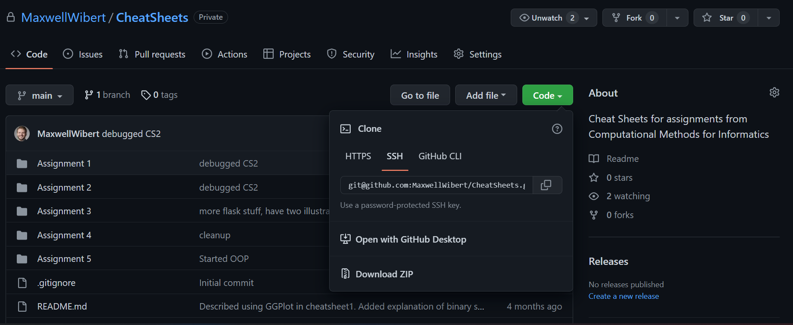

# Cheat Sheets
Welcome to Computational Methods for Informatics! 
Included in this README file are instructions for how to set up your development environment, as well as guidelines for using the instructional materials in this repository.
Note that the repository will likely change as the semester progresses, but each cheat sheet should be stable by the time its respective assignment is out. 

## Text Editor / IDE
This class will require you to write a few different types of files. 
Most of your assigments will either be in Python files (.py) or Jupyter notebooks (.ipynb) to do the computations for assigments, as well as some accompanying markdown files to explain your reasoning.
Later on, you'll have to work with HTML, CSS, JavaScript, and SQL, so it'll help to have tools for those tasks as well.
For such a wide array of tasks, Microsoft Visual Studio Code is a great option for coders of all skill levels. 
It has plenty of free downloadable extensions that help make your coding jobs easier (syntax highlighting, autocomplete, code snippets, and so on).

[Download VSCode](https://code.visualstudio.com/download)

## Terminal Shell
This course will require you to use terminal commands from time to time.
These cheat sheets assume you're using a Unix-like terminal shell program.
If you're using a Mac, the default terminal is ZShell (zsh), which works perfectly well with these.
If you're on Windows, your default terminal program is PowerShell, which is quite different from Unix-like terminal shells.
I would recommend you download [git for windows](https://gitforwindows.org/) which comes with a Git BASH terminal emulator. 
BASH should also work well with these tutorials.

Once you have a shell, it's good to get familiar with a few [basic shell commands](https://www.youtube.com/watch?v=J2zquYPJbWY).
At the very least, you should know the following shell commands:

## Github / Git
You'll need access to Github both for accessing this repository, as well as to submit assignments for the course. 
This process takes a few steps:
1. [Sign up a Github account](https://github.com/signup?ref_cta=Sign+up&ref_loc=header+logged+out&ref_page=%2F&source=header-home) if you don't already have one
2. [Create an SSH key on your terminal](https://docs.github.com/en/authentication/connecting-to-github-with-ssh/generating-a-new-ssh-key-and-adding-it-to-the-ssh-agent) and add it to your ssh-agent
3. [Add your SSH public key to your github account](https://docs.github.com/en/authentication/connecting-to-github-with-ssh/adding-a-new-ssh-key-to-your-github-account)

With the first three steps complete, your terminal should be able to interact directly with Github.
If you're reading this README.md file on your browser, now is a good time to clone this repository to your machine.
### Cloning a Github Repository


Go to the main page for the the repository and click the green "Code" button.
Next, click the "SSH" tab, and copy the URL to your clipboard.

Now open a terminal, use the `cd` command to move to whichever directory you'd like to store the repo in, and enter in the following command:

``` bash
git clone <URL>
```
making sure you replace "\<URL\>" with the actual URL of the repo that you copied earlier. 
Once the repo downloads, the `ls` command should confirm that git has created a new directory.
cd into this directory and run the following command:

``` bash
code .
```
This should run VSCode and set the current workspace folder to the repo's root directory.

Take a minute to get familiar with the structure and contents of the directory.
There is one folder for each assignment.
The main document within each folder is a Jupyter notebook (.ipynb) file, called something like "cheatsheet\<number\>.ipynb".
This notebook should help bring you up to speed on all the tools you'll need to complete the assignment. 
A Jupyter notebook is made up of a collection of "cells". 
Some of these cells will be Python code examples, some will be terminal commands, and some will be markdown explanations.
You won't be able to run any of the Python or Jupyter files until after you install Anaconda (later in this tutorial). To view the Markdown files in their full glory, first open the file in VSCode, then click on the markdown preview button in the top right corner (it looks like two rectangles with a magnifying glass)
.

Now that you know how to clone other people's repos, it's time you learn how to create and manage your own, since you'll need to do just that to submit assignments. 

## Creating/Managing Repos
Go to the Github home page on your browser, and click the green "New" button on the left side of the screen.


For this repo, you don't need to use a repository template.
Give the repository a sensible, descriptive name, and a short description that says what it's for.
Be sure to check the "Private" button for your homework repository unless you are keen on getting in trouble for academic integrity violations.
Check the "Add a README file" box, and ignore the .gitignore and license options.
Finally click the "Create Repository" button at the bottom. 
Github will now create the repository and direct you to its home page.
Clone you repo to your machine in the same way you cloned the CheatSheet repo.

You can now go into VSCode and open up your own repo, adding code and explanations for each assignment.
Whenever you make a change to the repo, those changes are by default only stored on your own computer.
Updating Github's copy of the repo is a multiple step process:

First, make sure to save the changes to all your files in VSCode.

Second, you have to tell git all of the changes you want to tell Github about.
For your purposes, it suffices to open a terminal, cd into the root folder of the repo, and run the command:
``` bash
git add .
```
which simply tells git that you want to tell Github about all the changes in the entire repo.

Third, you need to package these changes into a "commit", and give this commit a short, descriptive message about what that commit accomplishes.
This is accomplished by running a command similar the following:
``` bash
git commit -m "Wrote the installation instructions in README.md"
```
Last but not least, you need to send off all your changes to Github with the following command:
``` bash
git push  
```
### Why all the trouble? Why not just use Dropbox/Canvas?
Git is a version-control software tool.
It keeps a complete history of all the changes you make to your repository.
Since software development is an iterative process, you will likely break your own code as you try to update or improve it.
Bundling your changes into commits will allow you to [revert](https://docs.github.com/en/desktop/contributing-and-collaborating-using-github-desktop/managing-commits/reverting-a-commit) back to older versions of your code from before it was broken.
Moreover git helps you merge the code from multiple collaborators in group projects.

You can now submit homework, but you'll need an environment manager like Anaconda to actually be able to run and test the code you'll be submitting.

## Anaconda
Start by [installing Anaconda](https://docs.anaconda.com/anaconda/install/).
Once installation is complete, close your terminal shell and open it back up.
Then run the following commands:
``` bash
conda init
conda activate
```
These commands set up your conda environment, which should contain a Python interpreter and manage all the libraries we'll import into Python down the road.
Verify that Anaconda has installed python with the following shell command:
``` bash
python --version
```
The shell should respond with something like `Python 3.9.12`. 
If your shell responds with an error that says `python: command not found`, you will have to manually install Python using the following commands:
``` bash
conda update --all
conda install -c anaconda python=3.9
```

## Running Jupyter Notebooks in VSCode
With Anaconda and Python installed, you should be able to run Python files already.
In order to use Anaconda to run a Jupyter Notebook in VSCode, you're going to have to set that notebook's Python kernel to the one in your Anaconda environment.
To do so, open up the notebook that you'd like to run, and click the little computer tower symbol in the top right corner.


Now a dropdown menu should appear, allowing you to select which kernel to use. 
Click on the kernel with "base" in the name (this is the "base" environment for Anaconda).


## Using Anaconda for installing libaries 
Often in Python, we have to use existing modules in our projects.
These modules are brought into python with import statements like the following:
``` python
import pandas as pd
from plotnine import *
```
Some of these modules will be a part of the Python Standard Library, meaning the import statement will work right away.
Other modules come from third party libraries, meaning we will have to install them with Anaconda first.

For example, in order to run code cells in VSCode, you will have to install an IPython kernel with the following terminal command:

``` bash
conda install -c anaconda ipykernel
```
A similar command will be necessary to import modules from external libraries.
For example, the following command will install plotnine, a tool you will use often in this course.

``` bash
conda install -c conda-forge plotnine
```

If ever your notebook gives you an error about "\<insert module name\> does not exist", your best bet is to google the conda install command for that module.


